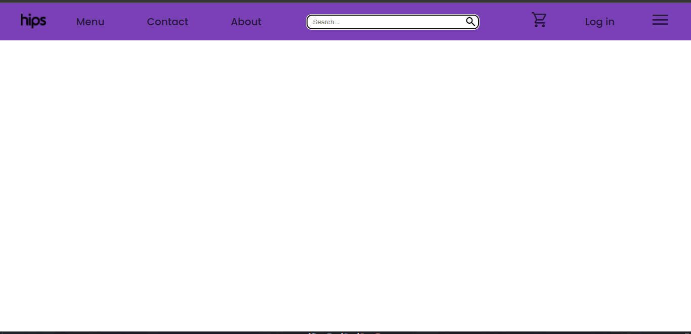

# Navbar Component

## Descrição
Este componente de barra de navegação (navbar) é uma parte crucial de um site, projetado para fornecer uma experiência de usuário intuitiva e acessível. Ele inclui uma logo, opções de páginas, um campo de pesquisa, um menu, um carrinho e uma seção de login. O componente foi desenvolvido para demonstrar habilidades em criação e implementação de interfaces de usuário e é um dos componentes principais do meu projeto de portfólio.

## Funcionalidades
- **Logo**: Exibe a logo da marca ou site, que geralmente é clicável e leva à página inicial.
- **Opções de Páginas**: Inclui links para as principais páginas do site, como "Home", "Sobre", "Serviços", e "Contato".
- **Campo de Pesquisa**: Permite aos usuários realizar buscas por conteúdo no site.
- **Menu**: Oferece um menu adicional com links para seções específicas ou opções extras.
- **Carrinho**: Exibe o ícone do carrinho de compras e, possivelmente, um contador de itens.
- **Login**: Seção para login do usuário, podendo incluir ícones ou um menu suspenso para acessar a conta.
  
### Tecnologias Utilizadas
HTML: Estrutura básica do componente.
CSS: Estilização da barra de navegação, incluindo layout, cores e fontes.

## Clone o Repositório

bash
Copiar código
git clone https://github.com/Heloizh/HTML.git
Navegue até o Diretório do Projeto

bash
Copiar código
cd Navbar
Abra o Arquivo HTML

Abra o arquivo index.html no seu navegador para visualizar o componente em ação.

## Contribuições
Sinta-se à vontade para contribuir com melhorias ou ajustes para este componente. Crie uma issue ou envie um pull request com suas sugestões!

## Contato
Se você tiver alguma dúvida ou sugestão, entre em contato com:

email: eloisamartins.trabalho@gmail.com
