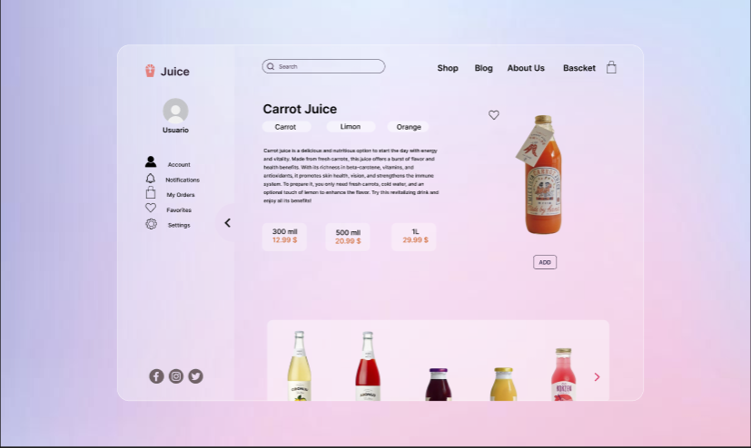
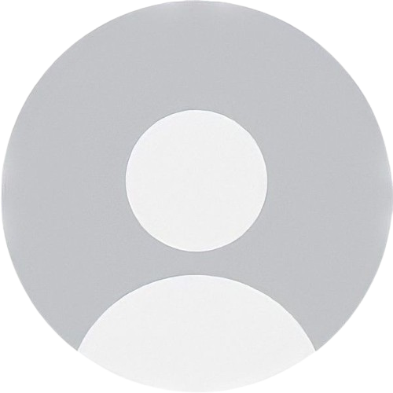
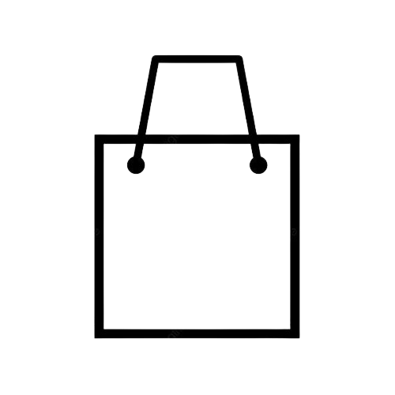
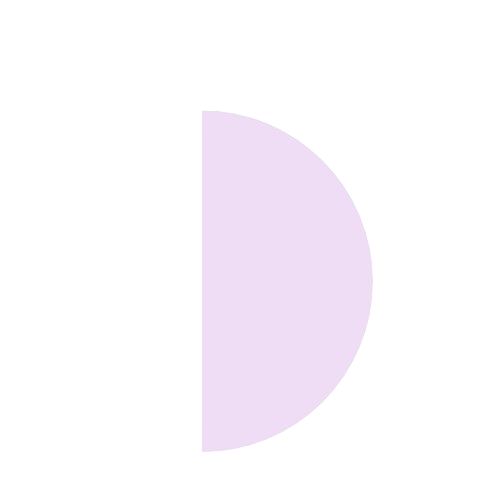
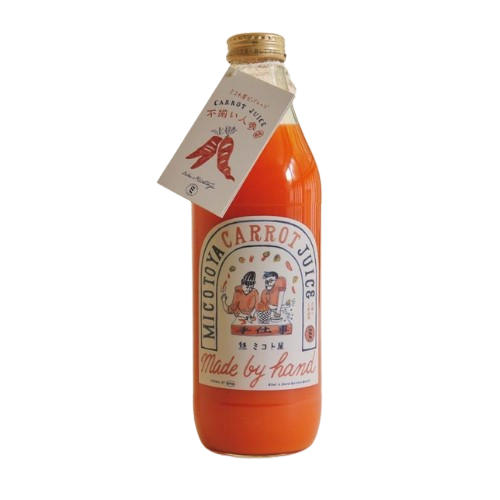

# Juice Shop Website



## Descrição

Este é um projeto de uma página web desenvolvida utilizando HTML, CSS e JavaScript. A página está atualmente em desenvolvimento e visa criar uma plataforma para a exibição de produtos, especificamente sucos. O projeto foca na responsividade e na criação de um menu de navegação funcional.

## Estado do Desenvolvimento

Até o momento, os seguintes elementos foram criados e implementados:

- Estrutura básica da página utilizando HTML.
- Estilização inicial com CSS.
- Implementação de alguns elementos da página, incluindo imagens e descrições de produtos.
- Menu lateral responsivo, que se ajusta a diferentes tamanhos de tela.

## Próximas Atualizações

As próximas etapas do desenvolvimento incluirão:

- Adição de dinâmicas e novas estilizações em CSS.
- Criação de uma vitrine de produtos para melhor exibição.
- Desenvolvimento de páginas adicionais para cada botão do menu.
- Inserção de formulários para permitir interações dos usuários.
- Melhoria contínua da responsividade e usabilidade da página.

## Atualizações Futuras

O projeto será atualizado regularmente no meu portfólio, refletindo as novas funcionalidades e melhorias à medida que o desenvolvimento avança. Fique atento para mais atualizações e novos recursos!

#Imagens

Imagens 

## Estrutura do Código

### HTML

```html
<!DOCTYPE html>
<html lang="en">
<head>
    <meta charset="UTF-8">
    <meta name="viewport" content="width=device-width, initial-scale=1.0">

    <!--font-->
    <link rel="preconnect" href="https://fonts.googleapis.com">
    <link rel="preconnect" href="https://fonts.gstatic.com" crossorigin>
    <link href="https://fonts.googleapis.com/css2?family=Inter:wght@100..900&family=Pixelify+Sans:wght@400..700&family=Play:wght@400;700&family=Poppins:ital,wght@0,100;0,200;0,300;0,400;0,500;0,600;0,700;0,800;0,900&display=swap" rel="stylesheet">
    <link rel="stylesheet" href="style.css">

    <!--icons-->
    <link rel="stylesheet" href="https://fonts.googleapis.com/css2?family=Material+Symbols+Outlined:opsz,wght,FILL,GRAD@20..48,100..700,0..1,-50..200" />

    <title>Shop Juice</title>
</head>
<body>
    <div class="container">
        <!--criando conteiner para janela de menu-->
        <div class="inner-container" id="innerContainer">        
            <!--logo-->
            <div class="logo-juice">Juice</div>
            <!--usuario--> 
            <button class="perfil-avatar">Usuario</button>   
            <!--criando barra de menu interna--> 
            <ul class="menu-acessibilidade">
                <button><li class="account">Account</li></button>
                <button><li class="notifications">Notification</li></button>
                <button><li class="myorders">My Orders</li></button>
                <button><li class="favorites">Favorites</li></button>
                <button><li class="settings">Settings</li></button>
            </ul>
            <!--icones de redes-sociais-->
             
        </div>

        <!--criando botão para abrir e fechar a janela de menu-->
        <div class="menu-header" onclick="toggleInnerContainer()">
            <span class="arrow" id="arrow">
                
                <span class="arrow-symbol" > <span class="material-symbols-outlined">chevron_right</span>
                </span>
            </span>
        </div>
     
        <!--container para a janela principal-->
        <div class="containerMain">
             <!--criando conteiner para campo de pesquisa e barra de menu-->
            <div class="barContainer">
                <!--criando campo de pesquisa-->
                <div class="search-bar"><span class="material-symbols-outlined">Search</span><input type="text" placeholder="Search" id="searchInput"></div>
                <!--criando lista da barra de menu-->
                <ul class="menu-bar">
                    <button><li class="shop">Shop</li></button>
                    <button><li class="blog">Blog</li></button>
                    <button><li class="aboutUs">About Us</li></button>
                    <button><li class="bascket">Bascket</li></button>
                </ul>
                <!--icon shopping cart-->
                <span id="shoppingCart" class="material-symbols-outlined">shopping_cart</span>
            </div>

            <!--criando conteiner de informação do produto-->
            <main class="infoContainer">
                <div class="info-products" id="c1">
                    <div class="informations">    
                        <h2 class="nameProducts">Carrot Juice</h2>
                        <ul class="listIngredients">
                            <li>Carrot</li>
                            <li>Limon</li>
                            <li>Orange</li>
                        </ul>
                        <p>Carrot juice is a delicious and nutritious option to start the day with energy and vitality. Made from fresh carrots, this juice offers a burst of flavor and health benefits. With its richness in beta-carotene, vitamins, and antioxidants, it promotes skin health, vision, and strengthens the immune system. To prepare it, you only need fresh carrots, cold water, and an optional touch of lemon to enhance the flavor. Try this revitalizing drink and enjoy all its benefits!</p>
                        <ul class="listPrice">
                            <button><li>300 ml</li><li class="price">12.99$</li></button>       
                            <button><li>500 ml</li><li class="price">20.99$</li></button>
                            <button><li>1l</li><li class="price">29.99$</li></button>
                        </ul>
                    </div>
                    <div class="products">
                          <span class="material-symbols-outlined">favorite</span>  
                          
                          <button>ADD</button>  
                    </div>
                </div>
            </main>
        </div>
    </div>

    <script src="script.js"></script>
</body>
</html>
```

### CSS

```css
* {
    padding: 0;
    margin: 0;
    box-sizing: border-box;
    font-family: 'Inter';
    color: #2C2C2C;
}

body {
    display: flex;
    align-items: center;
    justify-content: center;
    min-height: 100vh;
    overflow: hidden;
    background-image: url('images/image-fundo.jpeg');
    background-repeat: no-repeat;
    background-size: cover;
}

/*container geral*/
.container {
    position: relative;
    height: 550px;
    width: 800px;
    display: flex;
    overflow: hidden;
    background-color: rgba(255, 255, 255, 0.2);
    border-radius: 1rem;
    border: 2px solid rgb(254, 248, 248, 0.2);
}

/*JANELA DE MENU*/
.inner-container {
    width: 220px;
    background-color: rgba(255, 255, 255, 0.1);
    border-right: 1px solid rgb(254, 248, 248, 0.3);
    display: flex;
    flex-direction: column;
    justify-content: center;
    align-items: center;
    overflow: hidden;
}

.inner-container.hidden {
    display: none;
}

/*botão para abrir e fechar menu*/
.menu-header {
    width: 5%;
    display: flex;
    align-items: center;
    justify-content: center;
}

.arrow {
    display: flex;
    position: relative;
    align-items: center;
    justify-content: center;
    cursor: pointer;
}

.arrow-symbol {
    position: absolute;
    top: 43%;
    margin-left: -10px;
    transition: transform 0.1s ease;
}

.arrow-symbol.open {
    transform: translate(-20%, -20%) rotate(180deg);
}

.arrow-symbol.open + .inner-container {
    display: none;
}

.arrow-symbol:hover {
    opacity: 70%;
}
.arrow img {
    width: 80px;
    height: auto;
    margin-left: -25px;
}

.arrow img:hover {
    opacity: 70%;
}

/*botões de acesso*/
.menu-acessibilidade {
    width: 50%;
    height: 40%;
    transform: translate(10px, -50px);
    list-style-type: none;
}

.menu-acessibilidade img {
    display: flex;
    width: 25%;
    margin-left: -12px;
    transform: translate(-5px, 20px);
}

.menu-acessibilidade li {
    cursor: pointer;
    font-weight


